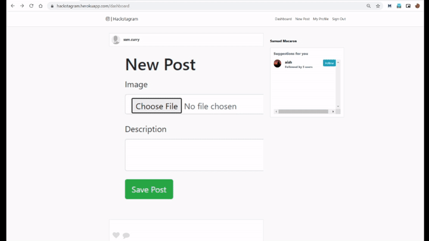

<h1 align="center">
   
  
</h1>

<h4 align="center">A CLI utility integrated with LeetCode for downloading your submissions and many more things</h4>

<h2 align="center"><a href = "https://hackstagram.herokuapp.com">Click here to view the deployed version</a></h4>

	
  <a href="https://rubyonrails.org/">
    
    <a href="https://github.com/SocioDroid/Hackstagram/commits/master">
       
      

  
## Features ⚡️
<h1 align="left">
   
   
</h1>

 - Ruby version 2.5.5
 - Uses AWS S3 bucket to store the images.
 - Gems: devise, acts_as_follower, populator, faker
